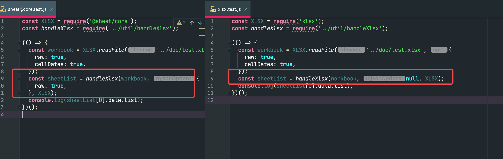

# sheetJsRunTest

sheetJsRunTest

### different in SheetJS Community Edition **AND**  SheetJs Pro Edition

```js
    XLSX.utils.sheet_to_json(WorkSheet, Sheet2JSONOpts)
```



### In SheetJs Pro Edition

you must pass Sheet2JSONOpts AS ``{raw:true}`` for XLSX.utils.sheet_to_json

